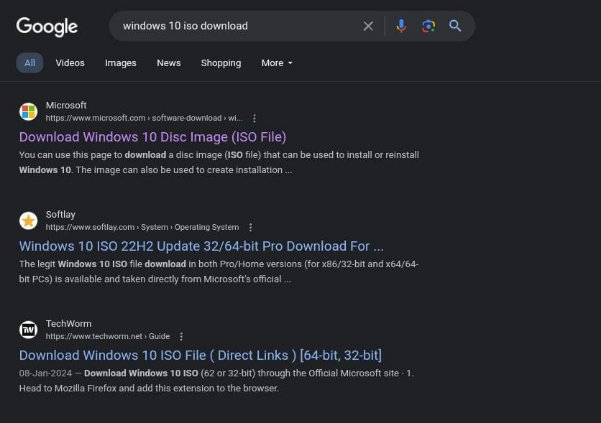
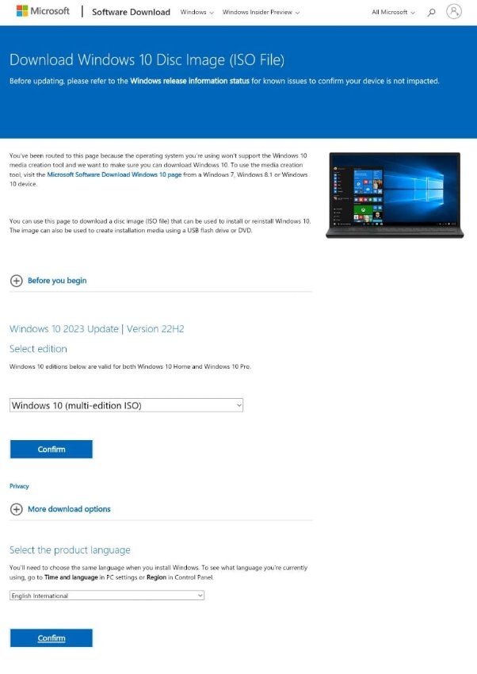
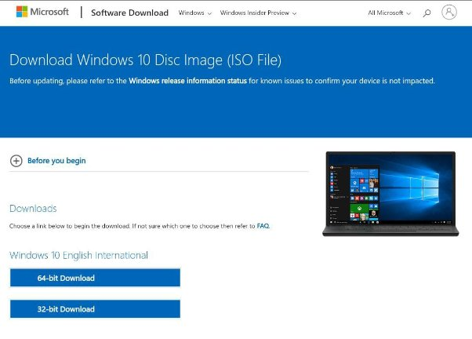

#                                      								**OS Lab 1 (Assignment)**

​          							     	   									**Submitted by:** 

​									            				Muhammad Abdul Barr        2022-CS-131

​												                  				    **Submitted to:**

​				                                                                    Sir Nouman Shaffi

​				           											**Department of Computer Science**

​						               						**University of Engineering and Technology**

​										                  							**Lahore Pakistan**

# **VMware:**
​					VMware is a software solution that enables the virtualization of operating systems on a single physical system. Essentially, it allows one physical computer to function as multiple virtual machines, each with its operating system and applications.

​					VMware uses the space allocated on your disk drive to Run the operating System, while running on fewer resources. VMware is Widely used for various purposes, i.e. Software Development and testing, Server Setups, etc.

# **Windows 10:**
Windows 10 is a widely used operating system developed by Microsoft Corporation, renowned for its user-friendly interface and extensive range of features. Introduced in July 2015 as the successor to Windows 8.1, Windows 10 quickly gained popularity among consumers and businesses alike.
# **Steps to Download and Install VMware:**

1. Google VMware and Go to the official website of VMware.

2. Click On the **VMware Workstation Player** Hyperlink.

3. Click On **Download For Free**

4. Click On **Go to Downloads** for latest version.

5. Choose VMware 17.5.0 for Windows 64-Bit and click on **Download Now**.

6. **Run** the Downloaded exe and click **next**.

7. **Check** the box and press **next**.

8. **Choose** Install location and Click **Next**.

10. Click **Next**.

11. Click **Next**.

12. Click on **Install**.

13. After Installation, You might be prompted to restart your PC. Save all your tasks and Click **Yes** to restart you PC.

# **Download Windows 10:**
You First Need to Download Windows 10 image file (.iso).

​								 

1. Google Windows 10 iso and Click on the Official Microsoft Website link.

   

2. Choose Windows 10 **Edition** and Press **Confirm**. Then, Choose **Language** and Press **Confirm**.

3. Choose **64-Bit version**.

# **Installing Windows 10 on VMware:**

1. Search **VMware** in windows search bar and **run** the application

2. Press **Continue**

3. Click on **Create New Virtual Machine.**

4. Click on **Browse** and **Locate** The Downloaded ISO file.

5. Choose the **ISO file** and Click **open**.

6. Choose Your OS **user name** and Press **Next**. 

7. Click **Yes**.

8. **Browse** Your Location To Where to Install Virtual OS. (**Note:** Choose the disk that have space available because OS is going to Utilize that drive space for its running and data)

9. **Allocate** Your Desired Space For Virtual OS and Click **Next**.

10. Wait For the Creation of Virtual OS to Complete. 

11. Click Finish

12. If you face **"VT-x error"**. Follow the Following instructions. Else, Skip to **Step 17**.

13. **Restart** you PC and On the Logo Display Screen. Press ESC (for **HP**). F12 (For **Dell**), F2 (for **Lenovo**).

14. Choose BIOS setup option.

15. Go to **Security** and Enable **Virtualization**.

16. Choose Exit Saving Changes.

17. **Re-run** VMware and Choose the **OS** and Press **Play Virtual Machine** (with green play icon).

18. Let The Windows **Complete its Installation**.

19. Congratulations!! Your First Virtual OS is now installed.

20. To Close OS. Click “Shut Down Guest”

# **GitHub Link**:
https://github.com/Muhammad-Abdul-Barr/OS-Manuals/Windows-Installation(Lab-01)

